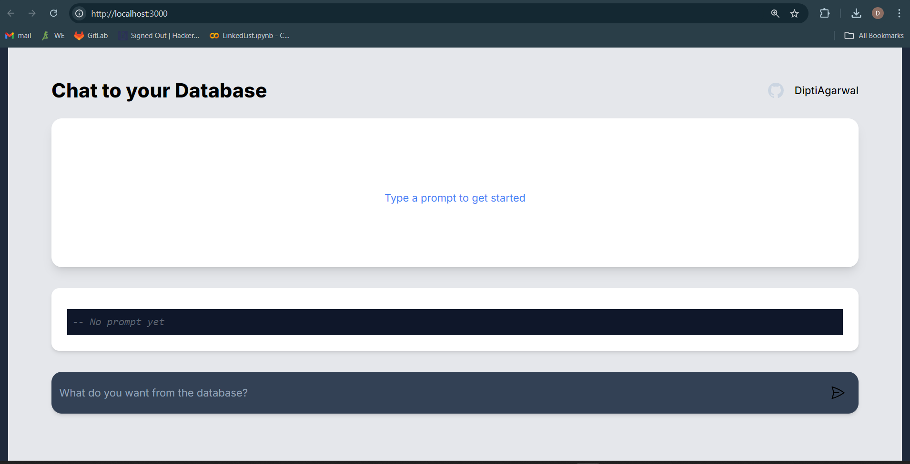

# Chat with Database

**Chat with Database** is a web application that allows users to interact with their database via natural language prompts. The app sends user queries to a backend API, processes the queries, and returns SQL commands along with query results. It provides a simple and intuitive interface to explore and manipulate databases without manually writing SQL.

## Features
- Type natural language prompts to interact with your database.
- Automatically generates SQL queries based on user input.
- View the generated SQL and query results in real-time.
- Clean, responsive user interface.
- Error handling for unsuccessful queries.

## Technologies Used
- **Frontend**: React.js, Next.js, Tailwind CSS
- **Backend**: Node.js, Express.js
- **Preloader**: Custom preloader for a smooth experience.

## Installation

Follow these steps to set up the project locally.

### Prerequisites
Make sure you have the following installed:
- Node.js (v14 or later)
- npm (included with Node.js)

### Clone the Repository
1. Clone the repository:  
   `git clone https://github.com/YourUsername/chat-with-database.git`

2. Navigate to the directory:  
   `cd chat-with-database`

### Install Dependencies
Run the following command to install dependencies:  
`npm install`

### Run the Development Server
Start the server with:  
`npm run dev`

Visit `http://localhost:3000` in your browser to view the app.

### API Setup
Configure your database and backend API endpoints. The default API endpoint for querying is at `http://localhost:3000/api/chat`.

## Folder Structure
- `components/`: Reusable UI components such as `ChatForm`, `DataTable`, and `Preloader`.
- `pages/`: Main pages, including the `Home` page.
- `public/`: Static assets like icons and images.

## Usage
Type a natural language prompt and submit it to query the database. SQL will be generated based on your input, and the results will be displayed.

## License
This project is licensed under the MIT License. Feel free to contribute and extend it to your needs.
